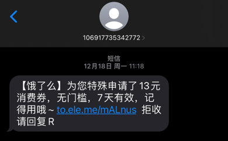
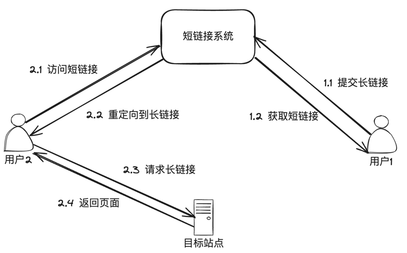
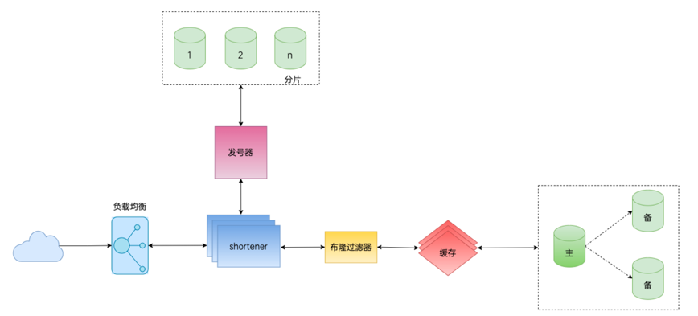

# go-zero短链接项目
## 什么是短链接
短链接，通俗来说就是将⽐较⻓的⼀个URL⽹址，通过程序计算等⽅式，转换为简短的⽹址字符串。
https://www.liwenzhou.com/posts/Go/golang-menu 这是⼀个很⻓的URL⽹址。
类似 q1mi.cn/1ly7vk 这种形式的就属于短链接。

## 为什么需要短链接
公司内部有很多需要发送链接的场景，业务侧的链接通常会⽐较⻓，在发送短信、IM⼯具发送消息、push等场景
下⻓链接有以下劣势：
1. 短信内容超⻓，1条消息被拆分成多条短信发送，浪费钱。
2. 微博等平台有字数限制。
3. ⻜书、钉钉等IM⼯具对⻓链接（带特殊服务号的）识别有问题。
4. 短链接转成⼆维码更清晰。

## 技术栈
#### · 编程语言: golang
#### · 使用技术: go-zero + MySQL + Redis + validate+ singleflight
#### · 描述：项目采用纯后端方式实现，没有前端

## 原理

## 项目架构图

